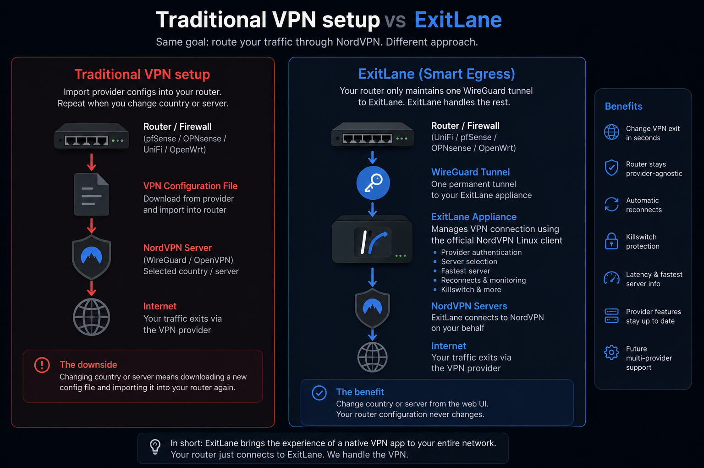
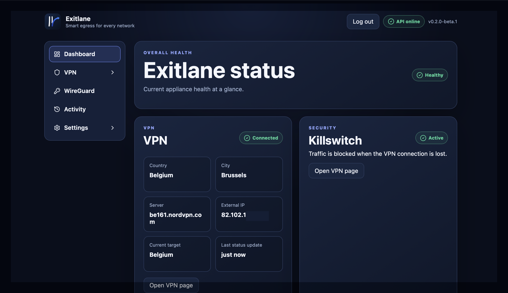
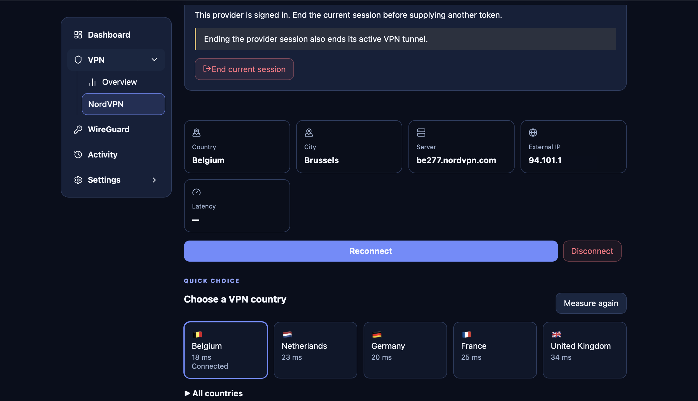
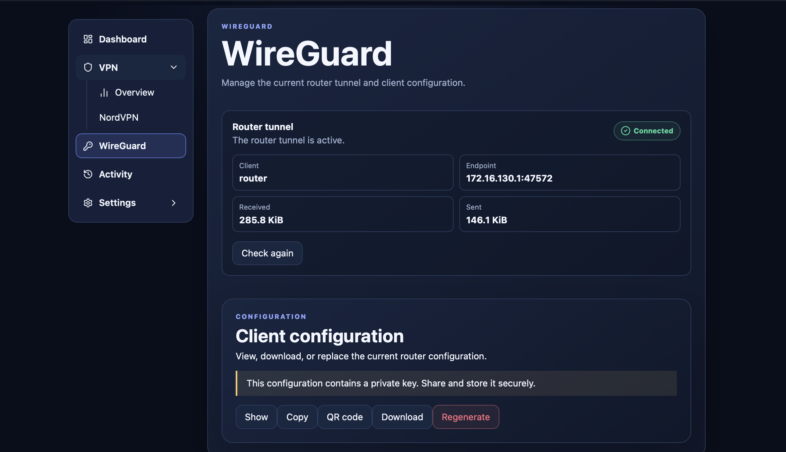
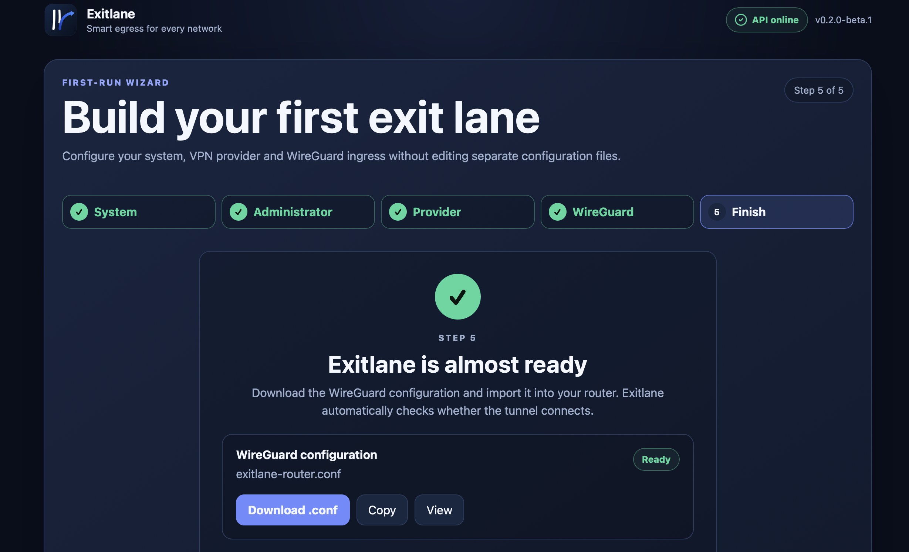
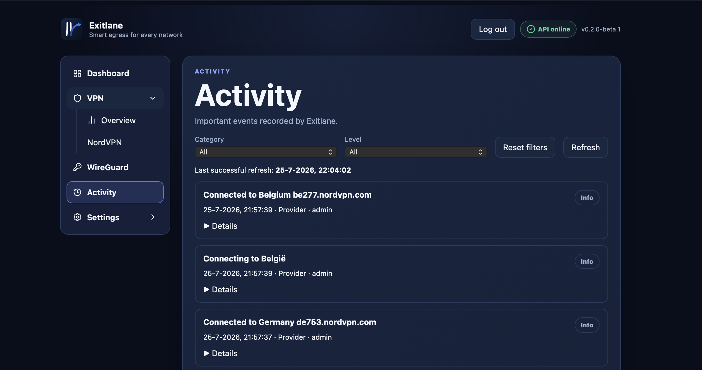

# ExitLane

**Smart egress for every network.**

ExitLane is a self-hosted egress appliance for routers, VLANs, and selected devices. Your router maintains one permanent WireGuard tunnel to ExitLane, while ExitLane uses the official NordVPN Linux client to manage the outbound VPN connection.

The result is an experience closer to a native VPN app, but for an entire network: switch countries, reconnect, use the fastest available server, and keep provider-specific configuration away from your router.



> [!WARNING]
> ExitLane is beta software. The management interface is intended for a trusted network and must not be exposed directly to the internet.

The trusted management network is a deployment assumption, not a substitute for application security. See the [hardening guide](docs/security/hardening-guide.md), [threat model](docs/security/threat-model.md), and [security policy](SECURITY.md).

## Why ExitLane?

Most routers can connect to commercial VPN providers by importing WireGuard or OpenVPN configuration files. That works, but changing countries or servers often means replacing those configurations in the router.

ExitLane separates the two responsibilities:

```text
Selected clients or VLANs
          |
        Router
          |
   permanent WireGuard tunnel
          |
       ExitLane
          |
 official NordVPN Linux client
          |
       Internet
```

Your router remains provider-agnostic. It only knows about the WireGuard peer. ExitLane handles provider authentication, server selection, reconnects, tunnel monitoring, and killswitch protection.

ExitLane does not replace UniFi, OPNsense, pfSense, or OpenWrt. It complements them by moving VPN-provider management into a dedicated appliance.

## Interface

### Appliance dashboard

Monitor appliance health, the active VPN exit, and killswitch protection from one overview.



### NordVPN control

Choose a VPN country from the browser, compare measured latency, reconnect, or let the official client select the server. No new provider configuration has to be imported into the router.



### WireGuard router tunnel

View the connected router peer and manage the current client configuration. The configuration can be viewed, copied, downloaded, shown as a QR code, or regenerated.



### Guided first-run setup

The first-run wizard checks the system, creates the administrator, installs and authenticates the provider, and generates the WireGuard router configuration.



### Activity log

Important authentication, setup, VPN, WireGuard, settings, notification, and system events are recorded in a translated and filterable activity view.



## Features

### VPN management

- Install, authenticate, configure, connect, and disconnect the official NordVPN Linux client.
- Switch VPN countries from the WebUI and compare measured latency for quick choices.
- Discover registered VPN providers and view provider authentication and tunnel status separately.
- Protect routed client traffic with a configurable killswitch when no usable VPN tunnel is active.

### WireGuard ingress

- Generate a WireGuard ingress interface and router client configuration.
- Monitor the connected router tunnel and transferred traffic.
- View, copy, download, display as QR code, or regenerate the current configuration.

### Authentication and security

- Create the first local administrator account during setup.
- Protect the application and API with expiring server-side sessions.
- Change the administrator password in Settings and revoke existing sessions.
- Recover a forgotten password locally with `sudo exitlane-cli reset-password`.
- Enable TOTP multifactor authentication, use one-time recovery codes, and manage active sessions.
- Run behind an explicitly trusted HTTPS reverse proxy.

### Appliance lifecycle

- Create passphrase-encrypted, authenticated appliance backups from the root-only CLI.
- Inspect and verify backups before a strictly staged local restore.
- Upgrade with an exclusive lifecycle lock, recovery snapshot, schema compatibility checks, and automatic rollback after installer failure.

### Operations

- Configure timezone, dashboard refresh interval, language, and light, dark, or system appearance.
- Configure generic webhook notifications.
- Keep structured activity events for up to 90 days and 5,000 records by default.
- Use the interface in English or Dutch.
- Integrate through the REST API.

## Architecture

ExitLane uses a FastAPI backend that serves both its API and a single-page frontend. The frontend coordinates shared data through central application state, while SQLite stores durable settings, users, sessions, and generated configuration metadata.

The VPN core is provider-neutral. NordVPN is the first provider implementation, and WireGuard provides independent ingress from routers and other clients.

See [Architecture](docs/architecture.md), [Authentication](docs/authentication.md), [WireGuard configuration management](docs/wireguard-configuration.md), [Application state](docs/application-state.md), and [Startup lifecycle](docs/startup-lifecycle.md) for the design rationale.

## Installation

The installer supports Debian 12 and 13. ExitLane is tested primarily in a Debian-based Proxmox LXC. An LXC must have `/dev/net/tun` and permission to create WireGuard interfaces.

```bash
git clone https://github.com/kevindraai/exitlane.git
cd exitlane
sudo ./installer/install-debian.sh
```

Open `http://<host>:8787` and complete the first-run wizard.

Read the [deployment guide](docs/deployment.md), [backup and restore guide](docs/backup-and-restore.md), [upgrade and recovery guide](docs/upgrade-and-recovery.md), and [Proxmox LXC notes](docs/proxmox-lxc.md) before using ExitLane outside a development environment.

Direct HTTP remains available on a trusted local network. For HTTPS termination, follow the [reverse-proxy guide](docs/deployment/reverse-proxy.md); ExitLane does not terminate TLS itself.

Docker is not currently a supported deployment method.

## Development

Work takes place on feature branches and reaches `main` through a pull request after CI passes. CI checks shell scripts, Python linting and tests, frontend syntax and tests, translations, JSON, security scanning, and package builds. Before merge, deploy the candidate to the test LXC and run its smoke test.

See [Development](docs/development.md) and [Contributing](CONTRIBUTING.md) for commands and the full workflow.

## Roadmap

Planned work, including additional VPN-provider implementations and deployment options, is tracked in the [roadmap](ROADMAP.md).

## AI involvement

ExitLane has been developed with extensive AI assistance. The project architecture, feature decisions, review, testing, and final technical decisions remain human-controlled. AI is used to accelerate implementation, tests, documentation, and iteration.

## License

ExitLane is licensed under the [GNU General Public License v3.0](LICENSE).
