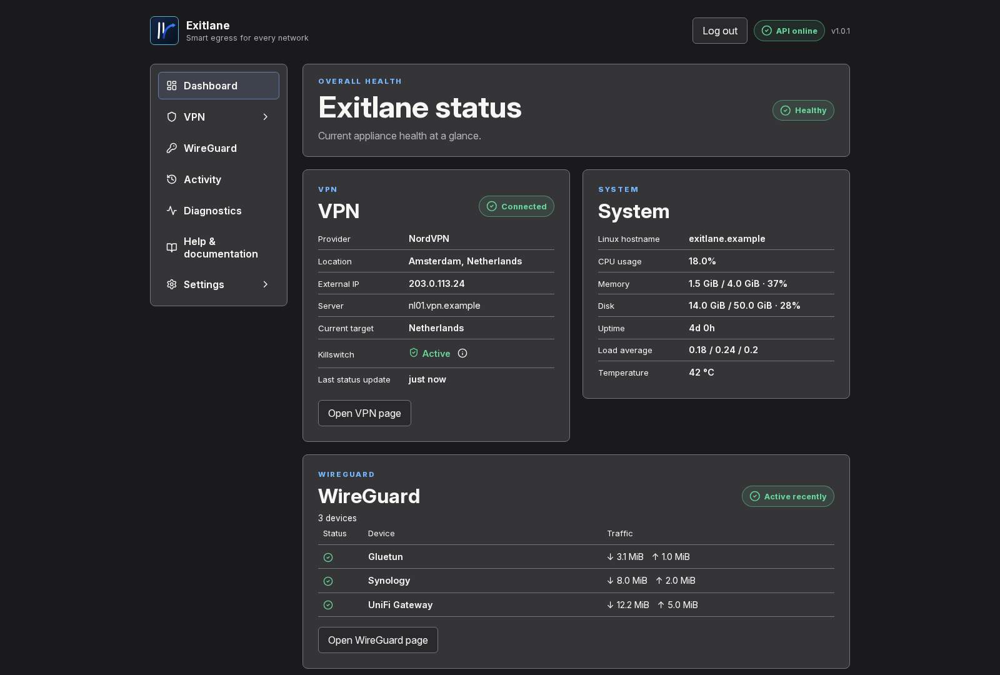
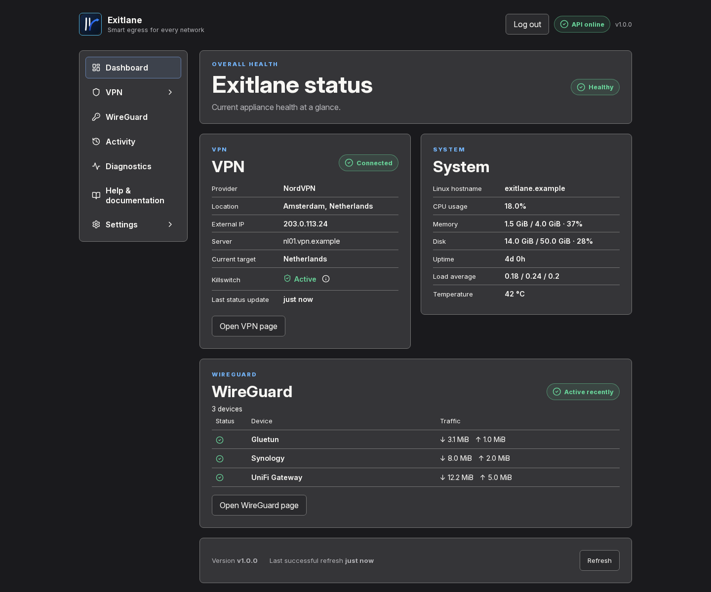
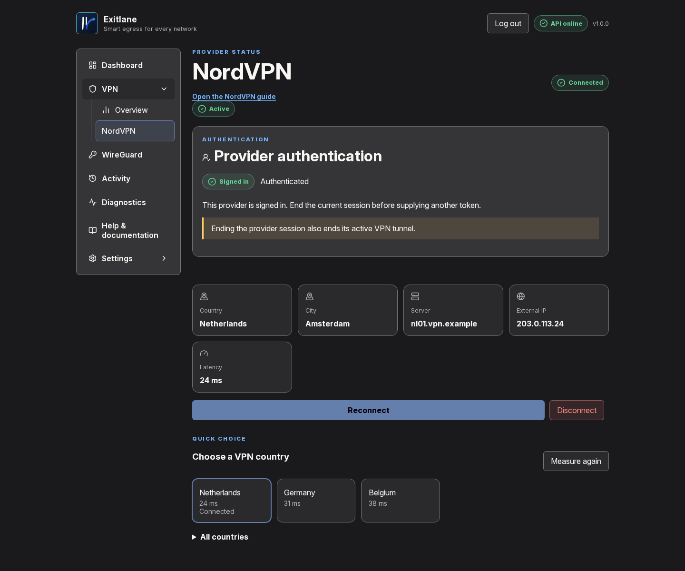
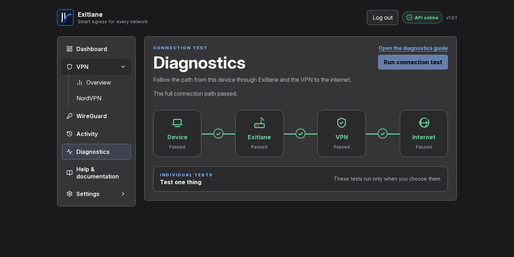
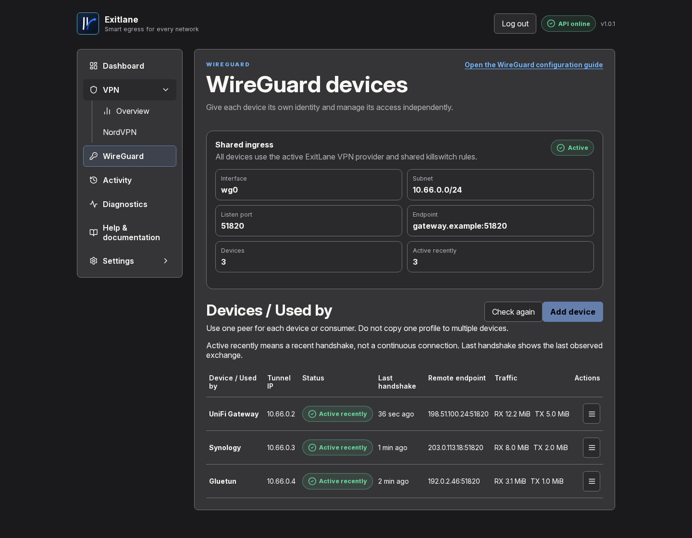
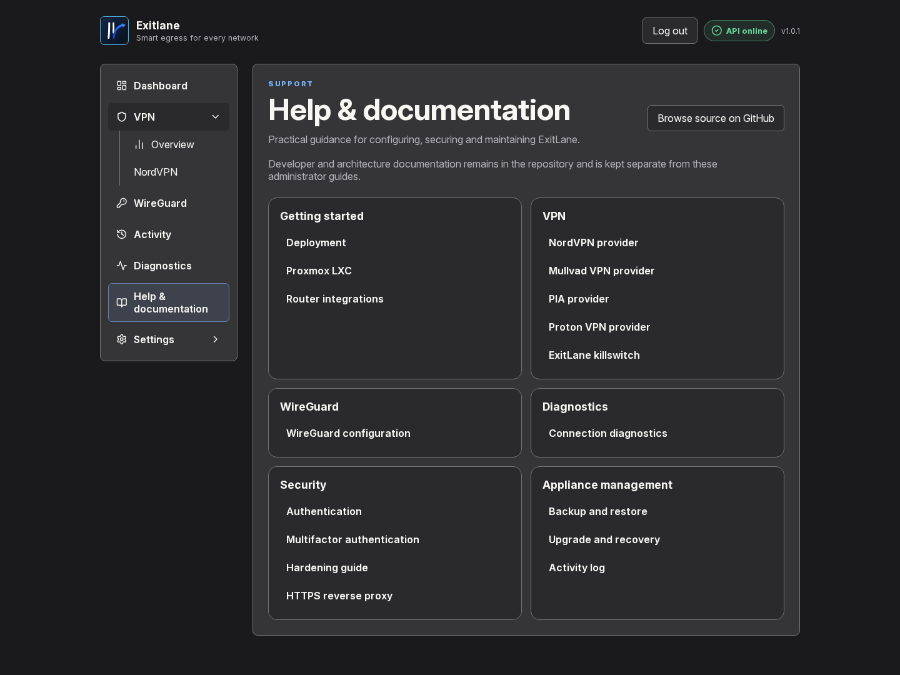

# ExitLane

**Smart egress for every network.**

ExitLane is a self-hosted egress appliance for routers, VLANs, and selected devices. Your router maintains one permanent WireGuard tunnel to ExitLane, while ExitLane manages outbound connection through NordVPN, Mullvad, PIA, or imported Proton VPN profiles.

The **1.0.0-rc.1** release candidate fixes the v1 support matrix: native Debian 13 amd64
with NordVPN, Mullvad, PIA and imported Proton, and the constrained Docker appliance with the
three direct providers. See [v1 RC release notes](docs/release-notes/1.0.0-rc.1.md).
Stable source and official image publication remain the final delivery steps; this candidate
does not claim the stable image is already available.

The result is an experience closer to a native VPN app, but for an entire network: switch countries, reconnect, use the fastest available server, and keep provider-specific configuration away from your router.



> [!WARNING]
> The management interface is intended for a trusted network and must not be exposed directly to the internet.

The trusted management network is a deployment assumption, not a substitute for application security. See the [hardening guide](docs/security/hardening-guide.md), [threat model](docs/security/threat-model.md), [2026-09-30 Daybreak Blue-assisted internal defensive assessment](docs/security/daybreak-blue-assessment-2026-09-30.md), and [security policy](SECURITY.md). This internal assessment is not an independent penetration test.

## Installation

The supported appliance baseline is Debian 13 on `amd64`. The qualified Proxmox configuration is a
**privileged LXC** with `/dev/net/tun` and permission to manage WireGuard, routing and nftables.
Other Debian releases, architectures and unprivileged LXC configurations are not supported release
targets. Keep the management interface on a trusted network.
On a Proxmox VE host, run the interactive launcher as root:

```bash
bash -c "$(curl -fsSL https://raw.githubusercontent.com/kevindraai/exitlane/main/installer/proxmox.sh)"
```

Choose Recommended or Advanced settings, then confirm the new-container plan. The launcher resolves
an exact published release and uses the same tag for the helper and guest installation.
See [Proxmox LXC](docs/proxmox-lxc.md) for defaults, trust, inspect-first and automation options.
The rc.4 qualification record distinguishes candidate testing from the required fresh
public-path installation against the published tag.

For a native Debian host or manually created LXC, install a published release tag rather than the moving development branch. For this release:

```bash
git clone --branch v1.0.0-rc.1 --depth 1 https://github.com/kevindraai/exitlane.git
cd exitlane
sudo ./installer/install-debian.sh
```

Open `http://<host>:8787` and complete the first-run wizard.

Use the tagged installation command once the candidate is published on the
[Releases page](https://github.com/kevindraai/exitlane/releases). For an existing appliance,
[create and verify a backup before upgrading](docs/upgrade-and-recovery.md).

Read the [deployment guide](docs/deployment.md), [NordVPN provider guide](docs/nordvpn.md), [Mullvad provider guide](docs/mullvad.md), [PIA provider guide](docs/pia.md), [Proton provider guide](docs/proton.md), [backup and restore guide](docs/backup-and-restore.md), [upgrade and recovery guide](docs/upgrade-and-recovery.md), and [Proxmox LXC notes](docs/proxmox-lxc.md) before using ExitLane outside a development environment.

Direct HTTP remains available on a trusted local network. For HTTPS termination, follow the [reverse-proxy guide](docs/deployment/reverse-proxy.md); ExitLane does not terminate TLS itself.

## Providers

Native ExitLane supports NordVPN, direct Mullvad and PIA WireGuard, and imported Proton
WireGuard profiles. PIA needs no provider app or OpenVPN; Proton needs no CLI, NetworkManager
or desktop keyring. PIA and Proton are implemented and synthetically / native-kernel qualified;
live commercial-provider connectivity remains unproven. Direct providers currently offer IPv4
egress, with IPv6 protected and blocked. See the [provider guides](docs/architecture/providers.md).

## Why ExitLane?

Most routers can connect to commercial VPN providers by importing WireGuard or OpenVPN configuration files. That works, but changing countries or servers often means replacing those configurations in the router.

ExitLane separates the two responsibilities:

```text
Selected clients or VLANs
          |
        Router
          |
   permanent WireGuard tunnel
          |
       ExitLane
          |
 active commercial VPN provider
          |
       Internet
```

Your router remains provider-agnostic. It only knows about the WireGuard peer. ExitLane handles provider authentication, server selection, reconnects, tunnel monitoring, and killswitch protection.

ExitLane does not replace UniFi, OPNsense, pfSense, or OpenWrt. It complements them by moving VPN-provider management into a dedicated appliance.

## Interface

### Appliance dashboard

Monitor appliance health, the active VPN exit, WireGuard ingress, killswitch protection, and system
resources from one overview.



### VPN provider control

Configure NordVPN, Mullvad VPN, PIA, or imported Proton WireGuard profiles. Choose one active provider and reconnect without importing new provider configuration into the router. PIA and Proton use ExitLane-owned direct WireGuard; live provider qualification remains outstanding for both.



### Connection diagnostics

Trace the live path from the client through ExitLane and the VPN to the internet. Individual ping,
DNS, external-IP, and bandwidth-aware Speedtest actions remain explicit administrator choices.



### WireGuard router tunnel

View the connected router peer and manage the current client configuration. The configuration can be viewed, copied, downloaded, shown as a QR code, or regenerated.



### Integrated documentation

Open version-matched administrator guides in the WebUI and follow contextual links directly from
the relevant operational screen.



## Features

### VPN management

- Manage the NordVPN Linux client and ExitLane-owned direct Mullvad, PIA and Proton WireGuard egress.
- Keep multiple providers installed and signed in while enforcing exactly one active egress provider.
- Switch VPN countries from the WebUI and compare measured latency for quick choices.
- Discover registered VPN providers and view provider authentication and tunnel status separately.
- Protect routed client traffic with a configurable killswitch when no usable VPN tunnel is active.
- Keep active or interrupted direct-provider transactions protected independently of that optional
  killswitch. Enable the killswitch when clients must also remain blocked after an explicit disconnect.

### WireGuard ingress

- Generate a WireGuard ingress interface and router client configuration.
- Monitor the connected router tunnel and transferred traffic.
- View, copy, download, display as QR code, or regenerate the current configuration.

### Authentication and security

- Create the first local administrator account during setup.
- Protect the application and API with expiring server-side sessions.
- Change the administrator password in Settings and revoke existing sessions.
- Recover a forgotten password locally with `sudo exitlane-cli reset-password`.
- Under **Settings > System**, an authenticated administrator can restart only
  `exitlane.service`, reboot the instance, or shut it down. Shutdown cannot be
  reversed from ExitLane; host, hypervisor, or physical access is required.
- Enable TOTP multifactor authentication, use one-time recovery codes, and manage active sessions.
- Run behind an explicitly trusted HTTPS reverse proxy.

### Appliance lifecycle

- Create passphrase-encrypted, authenticated appliance backups from the root-only CLI.
- Inspect and verify backups before a strictly staged local restore.
- Upgrade with an exclusive lifecycle lock, recovery snapshot, schema compatibility checks, and automatic rollback after installer failure.

### Operations

- Configure the Debian appliance timezone, dashboard refresh interval, language, and light, dark,
  or system appearance.
- Configure generic webhook notifications.
- Keep structured activity events for up to 90 days and 5,000 records by default.
- Use the interface in English or Dutch.
- Integrate through the REST API.
- Trace Device -> ExitLane -> VPN -> Internet with structured connection diagnostics and explicit
  ping, DNS, external-IP, and speed-test actions.
- Open version-matched administrator documentation inside the WebUI and follow contextual guide
  links from the relevant operational screens.

## Architecture

ExitLane uses a FastAPI backend that serves both its API and a single-page frontend. The frontend coordinates shared data through central application state, while SQLite stores durable settings, users, sessions, and generated configuration metadata.

The VPN core is provider-neutral. NordVPN and Mullvad VPN are release-qualified commercial-provider implementations. PIA and imported Proton profiles use synthetic qualification; live provider qualification remains outstanding. WireGuard provides independent ingress from routers and other clients. A provider is optional; direct internet egress remains a supported setup choice.

See [Architecture](docs/architecture.md), [Authentication](docs/authentication.md), [WireGuard configuration management](docs/wireguard-configuration.md), [Connection diagnostics](docs/diagnostics.md), [Application state](docs/application-state.md), and [Startup lifecycle](docs/startup-lifecycle.md) for the design rationale.

The WebUI's semantic theme adoption is recorded in the
[ExitLane design-system mapping](docs/design-system.md).


## Security posture

The supported appliance uses fail-closed provider transactions, validated WireGuard configuration
and restore boundaries, bounded requests/provider input, encrypted provider keys, and root-only
backup/recovery. Keep the optional killswitch enabled when protected clients must remain blocked
also after an explicit disconnect. The Daybreak assessment is internal defensive evidence,
not an independent external penetration test. See the [security documentation](docs/security/security-testing.md).

## Docker appliance

The v1 Docker support contract is Linux amd64, rootful Docker Engine >=28 and Compose v2,
with `NET_ADMIN`, TUN, a read-only root filesystem and durable state. Docker supports Mullvad,
PIA and imported Proton WireGuard; native ExitLane additionally supports NordVPN.
NordVPN is unavailable inside Docker. Protected Docker clients always use provider-or-block.
Live commercial PIA/Proton interoperability remains unqualified.

Follow the [complete Docker Quick Start](docs/docker-deployment.md#quick-start) for exact
versioned files, explicit host LAN binds, image digest pinning, preflight and setup. It also
covers health, persistence, backup/export/verification/restore, upgrades and rollback. The
official target is `ghcr.io/kevindraai/exitlane:v1.0.0`; stable image publication, attestations,
exact-image qualification and anonymous pull are mandatory remaining delivery evidence.
No `latest` alias is defined. Reviewed unfixed Debian findings receive transparent residual-risk
dispositions under [SECURITY](SECURITY.md); actionable findings still block publication.

## Development

Work takes place on feature branches and reaches `main` through a pull request after CI passes. CI checks shell scripts, Python linting and tests, frontend syntax and tests, translations, JSON, security scanning, and package builds. Before merge, deploy the candidate to the test LXC and run its smoke test.

See [Development](docs/development.md) and [Contributing](CONTRIBUTING.md) for commands and the full workflow.

## Roadmap

Remaining qualification, publication and development work is tracked in the [roadmap](ROADMAP.md).

## AI involvement

ExitLane has been developed with extensive AI assistance. The project architecture, feature decisions, review, testing, and final technical decisions remain human-controlled. AI is used to accelerate implementation, tests, documentation, and iteration.

## License

ExitLane is licensed under the [GNU General Public License v3.0](LICENSE).
